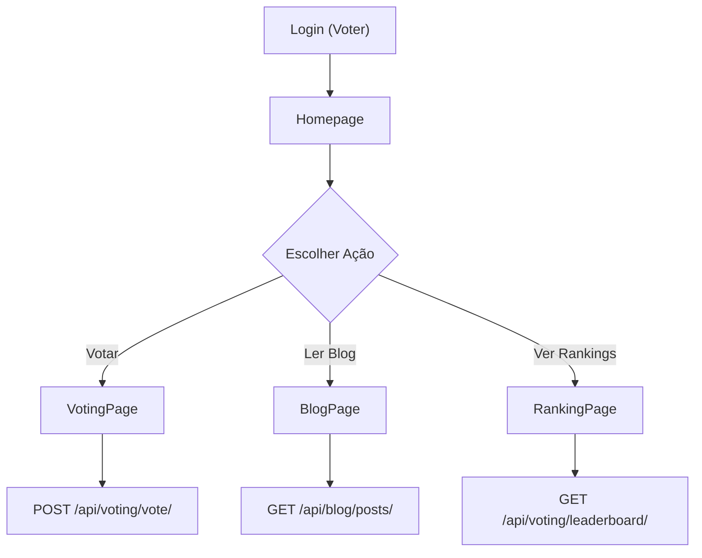
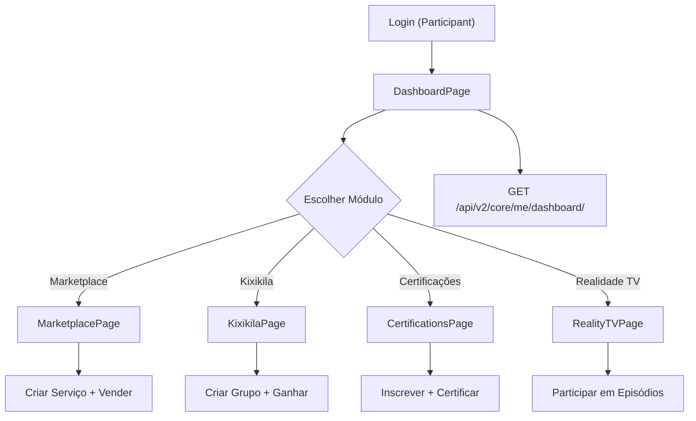
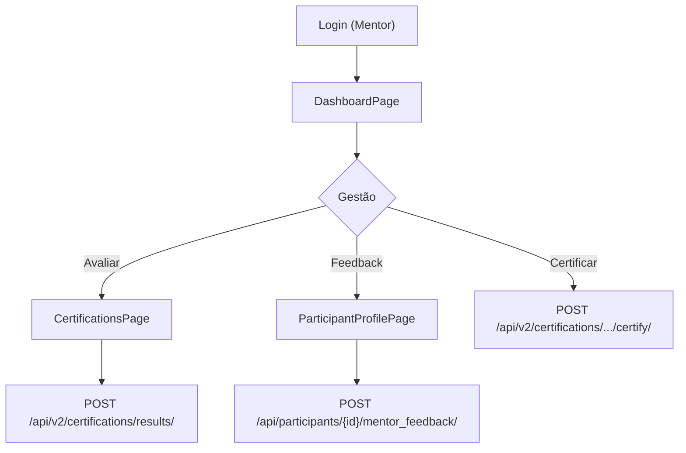
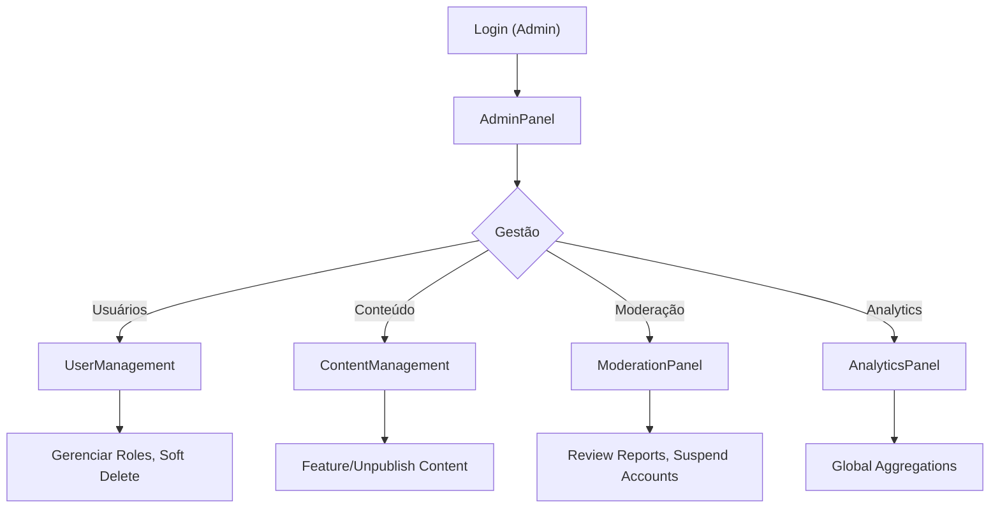

# 📊 ANÁLISE PROFUNDA: PERFIS DE USUÁRIO E ALINHAMENTO COM MÓDULOS

## 1. DEFINIÇÃO DOS PERFIS (USER_TYPES)

### A. Eleitor (Voter) - Baseline
- **Capacidade**: Apenas leitura de participantes e votação
- **Acesso**: Public + autenticado
- **Restrições**: Sem acesso a módulos avançados

| Módulo | Acesso | Ações | Notas |
|--------|--------|-------|-------|
| **Participantes** | ✅ Visualizar | Ver lista, perfil, histórico | Public read |
| **Votação** | ✅ Votação | Votar em participantes | 1 voto/user/season |
| **Temporadas** | ✅ Visualizar | Ver episódios, rankings | Public read |
| **Marketplace** | ❌ | - | Não autorizado |
| **Certificações** | ❌ | - | Não autorizado |
| **Kixikila** | ❌ | - | Não autorizado |
| **Blog** | ✅ Visualizar | Ler artigos | Public read |
| **Dashboard** | ❌ | - | Sem painel pessoal |

---

### B. Participante (Participant)
- **Capacidade**: Participação na temporada, marketplace, learn-to-earn
- **Acesso**: Eleitor + participação + marketplace + kixikila
- **Restrições**: Admin apenas para próprios recursos

| Módulo | Acesso | Ações | Notas |
|--------|--------|-------|-------|
| **Participantes** | ✅ Visualizar | Ver outros, próprio perfil | Read own + others |
| **Votação** | ✅ Votação | Votar em pares | Standard voter |
| **Marketplace** | ✅ Completo | Listar, criar, vender | Own service provider |
| **Kixikila** | ✅ Completo | Criar/gerir grupos | Own membership |
| **Certificações** | ✅ Completo | Inscrever-se, concluir | Own enrollment |
| **Temporadas** | ✅ Participação | Criar perfil, episódios | Own data |
| **Blog** | ✅ Visualizar | Ler artigos | Public read |
| **Dashboard** | ✅ Pessoal | Métricas, earnings, trust | Own aggregations |

---

### C. Mentor (Mentor)
- **Capacidade**: Oversee participantes, avaliar, feedback
- **Acesso**: Participante + mentoring + admin moderado
- **Restrições**: Dados da turma, sem edição de config global

| Módulo | Acesso | Ações | Notas |
|--------|--------|-------|-------|
| **Participantes** | ✅ Visualizar | Lista completa, avaliar | Read + score write |
| **Votação** | ✅ Votação | Votar + moderar | Standard voter + mod |
| **Marketplace** | ✅ Visualizar | Lista, ratings | Read only + moderate |
| **Kixikila** | ✅ Visualizar | Grupos, ciclos | Read only |
| **Certificações** | ✅ Completo | Avaliar, certificar | Grade + issue certs |
| **Temporadas** | ✅ Moderado | Feedback, score | Episode feedback |
| **Blog** | ✅ Criar | Escrever artigos | Own posts only |
| **Dashboard** | ✅ Pessoal | Métricas de mentoria | Turma stats |

---

### D. Admin (Admin)
- **Capacidade**: Controle total do sistema
- **Acesso**: Tudo
- **Restrições**: Nenhuma (exceto deletar usuários críticos - soft delete)

| Módulo | Acesso | Ações | Notas |
|--------|--------|-------|-------|
| **Todos** | ✅ Total | CRUD, bulk ops, soft delete | Full access |
| **Dashboard** | ✅ Global | Stats globais, auditoria | All-user aggregations |
| **Permissões** | ✅ Admin | Gerenciar roles, perms | System-wide |
| **Analytics** | ✅ Total | Eventos, funnel, cohorts | Full tracing |

---

## 2. MAPA MODULAR DETALHADO

### Módulo: Participantes
**Backend**: `backend/participants/`
**Frontend**: `src/pages/ParticipantsPage`, `src/pages/ParticipantProfilePage`
**Endpoints**:
- `GET /api/participants/` - List (AllowAny)
- `GET /api/participants/{id}/` - Detail (AllowAny)
- `PUT /api/participants/{id}/` - Update own (IsAuthenticated + owner)
- `GET /api/participants/dashboard/` - Dashboard (IsAuthenticated + own)

**Permissões por Perfil**:
```
Voter      → GET list/detail
Participant → GET + PUT own + GET own dashboard
Mentor     → GET all + GET own + Write score
Admin      → GET/PUT/DELETE all + bulk ops
```

---

### Módulo: Votação
**Backend**: `backend/voting/`
**Frontend**: `src/pages/VotingPage`, `src/components/VotingCard`
**Endpoints**:
- `GET /api/voting/participants/` - List votable (AllowAny)
- `POST /api/voting/vote/` - Cast vote (IsAuthenticated)
- `GET /api/voting/leaderboard/` - Rankings (AllowAny)

**Permissões por Perfil**:
```
Voter      → GET list + POST vote + GET leaderboard
Participant → GET list + POST vote + GET leaderboard
Mentor     → GET list + POST vote + GET leaderboard + moderate
Admin      → All + nullify votes + bulk vote
```

---

### Módulo: Marketplace
**Backend**: `backend/marketplace/`
**Frontend**: `src/pages/MarketplacePage`, `src/components/ServiceCard`
**Endpoints**:
- `GET /api/v2/marketplace/listings/` - List (AllowAny)
- `POST /api/v2/marketplace/listings/` - Create (IsAuthenticated)
- `GET /api/v2/marketplace/categories/` - Categories (AllowAny)
- `POST /api/v2/marketplace/orders/` - Order (IsAuthenticated)

**Permissões por Perfil**:
```
Voter      → ❌ No access
Participant → GET list + POST listing (own) + POST order + manage orders
Mentor     → GET list + moderate listings (public)
Admin      → All + feature/unfeature + suspend accounts
```

---

### Módulo: Kixikila (Learn-to-Earn)
**Backend**: `backend/kixikila/`
**Frontend**: `src/pages/KixikilaPage`
**Endpoints**:
- `GET /api/v2/kixikila/groups/` - List (AllowAny)
- `POST /api/v2/kixikila/groups/` - Create (IsAuthenticated)
- `POST /api/v2/kixikila/memberships/` - Join (IsAuthenticated)
- `POST /api/v2/kixikila/payouts/` - Claim (IsAuthenticated)

**Permissões por Perfil**:
```
Voter      → ❌ No access
Participant → GET + POST group (own) + POST membership + claim payouts
Mentor     → GET + moderate groups
Admin      → All + suspend/delete
```

---

### Módulo: Certificações
**Backend**: `backend/certifications/`
**Frontend**: `src/pages/CertificationsPage`
**Endpoints**:
- `GET /api/v2/certifications/programs/` - List (AllowAny)
- `POST /api/v2/certifications/enrollments/` - Enroll (IsAuthenticated)
- `POST /api/v2/certifications/enrollments/{id}/complete/` - Complete (IsAuthenticated)
- `POST /api/v2/certifications/enrollments/{id}/certify/` - Issue cert (IsAdminUser)

**Permissões por Perfil**:
```
Voter      → ❌ No access
Participant → GET + POST enrollment (own) + complete (own)
Mentor     → GET + POST results (own turma) + certify (own)
Admin      → All + issue certs + manage programs
```

---

### Módulo: Temporadas/Realidade
**Backend**: `backend/seasons/`
**Frontend**: `src/pages/RealityTVPage`
**Endpoints**:
- `GET /api/seasons/` - List (AllowAny)
- `GET /api/seasons/{id}/episodes/` - Episodes (AllowAny)
- `POST /api/seasons/{id}/participants/` - Join (IsAuthenticated)

**Permissões por Perfil**:
```
Voter      → GET list + GET episodes
Participant → GET + POST participant (own season)
Mentor     → GET + POST feedback (own)
Admin      → All CRUD + feature episodes
```

---

### Módulo: Blog
**Backend**: `backend/blog/`
**Frontend**: `src/pages/BlogPage`
**Endpoints**:
- `GET /api/blog/posts/` - List (AllowAny)
- `GET /api/blog/posts/{id}/` - Detail (AllowAny)
- `POST /api/blog/posts/` - Create (IsAuthenticated + has_permission)
- `PUT /api/blog/posts/{id}/` - Update (IsAuthenticated + owner/admin)

**Permissões por Perfil**:
```
Voter      → GET list/detail
Participant → GET + publish own articles
Mentor     → GET + publish own articles
Admin      → All + feature/unpublish
```

---

### Módulo: Core Dashboard
**Backend**: `backend/core/`
**Frontend**: `src/pages/DashboardPage`
**Endpoints**:
- `GET /api/v2/core/me/dashboard/` - Personal (IsAuthenticated)
- `GET /api/v2/core/me/revenue/` - Revenue (IsAuthenticated)
- `GET /api/v2/core/me/activity/` - Activity (IsAuthenticated)

**Permissões por Perfil**:
```
Voter      → ❌ No dashboard
Participant → GET own data (trust, market, kixi, certs, reality)
Mentor     → GET own + turma data
Admin      → GET all + global aggregations
```

---

## 3. MATRIZ DE ACESSO (Resumo)

```
┌──────────────────┬────────┬──────────────┬────────┬───────┐
│ Módulo           │ Voter  │ Participant  │ Mentor │ Admin │
├──────────────────┼────────┼──────────────┼────────┼───────┤
│ Participantes    │ 🔍 R   │ 🔍 R + ✏️ W  │ 🔍 R + │ 🔧 *  │
│ Votação          │ ✅ RW  │ ✅ RW        │ ✅ RW+ │ 🔧 *  │
│ Marketplace      │ ❌     │ ✅ RW        │ 🔍 R   │ 🔧 *  │
│ Kixikila         │ ❌     │ ✅ RW        │ 🔍 R   │ 🔧 *  │
│ Certificações    │ ❌     │ ✅ RW        │ ✅ RWM │ 🔧 *  │
│ Temporadas       │ 🔍 R   │ ✅ RW        │ ✅ RWM │ 🔧 *  │
│ Blog             │ 🔍 R   │ 🔍 R + ✏️ W  │ ✏️ W   │ 🔧 *  │
│ Dashboard        │ ❌     │ ✅ own       │ ✅ own │ 🔧 *  │
│ Analytics        │ ❌     │ ❌           │ ❌     │ ✅    │
│ Admin Panel      │ ❌     │ ❌           │ ❌     │ ✅    │
└──────────────────┴────────┴──────────────┴────────┴───────┘

Legenda:
🔍 R   = Read-only (list/detail)
✅ RW  = Read + Write own
✏️ W   = Write own only
🔍 R+  = Read + score/evaluate
✅ RWM = Read + Write + Moderate
🔧 *   = Full admin access (CRUD + bulk + suspend)
❌     = No access
```

---

## 4. FLUXOS CRÍTICOS POR PERFIL

### Fluxo Voter (Eleitor)


### Fluxo Participant (Participante)


### Fluxo Mentor (Mentor)


### Fluxo Admin (Admin)


---

## 5. RECOMENDAÇÕES DE IMPLEMENTAÇÃO

### Fase 1: Consolidar User Model
✅ **Já feito:**
- User com `user_type` (voter, participant, mentor, admin)
- OneToOne Participant para participants

⚠️ **Faltante:**
- Middleware RBAC validação em todas ViewSets
- Permission classes específicas por módulo
- Feature flags por user_type

### Fase 2: Alinhamento Frontend
✅ **Parcial:**
- useAuth context com user_type
- usePermissions hook (verificar implementação)

⚠️ **Faltante:**
- Role-based nav rendering (esconder módulos)
- Upgrade CTAs (PLG unlock)
- Progressive disclosure por perfil

### Fase 3: Dashboard Pessoal
✅ **Backend:**
- core/views.py com MeDashboardViewSet

⚠️ **Frontend:**
- Falta componentes de dashboard por perfil
- Métricas diferentes por user_type
- Animations/polish

---

## 6. PRÓXIMAS AÇÕES PRIORITÁRIAS

1. **Implementar Feature Flags por User Type**
   - Marketplace → participant + admin apenas
   - Kixikila → participant + admin apenas
   - Certificações → participant + mentor + admin
   - Blog → todos + special perms para mentor/admin

2. **Role-Based Navigation**
   - HomepageNav mostrar apenas módulos permitidos
   - Progressive disclosure (ver "Desbloquear" para ❌)
   - Upgrade flow (voter → participant)

3. **Dashboard Pessoal**
   - Voter: Resumo de votos + rankings
   - Participant: Marketplace sales, Kixi earnings, Certs progress
   - Mentor: Turma stats, certification tracking
   - Admin: Global stats + moderation queue

4. **API Permission Classes**
   - ParticipantOnlyPermission
   - MentorOrAdminPermission
   - OwnerOrAdminPermission

5. **Testing & Validation**
   - Unit tests por permission classe
   - Integration tests para fluxos críticos
   - E2E tests para role transitions

---

## 7. NOTAS E OBSERVAÇÕES

- **Soft Delete**: Participants e users devem usar soft delete, não hard delete
- **Audit Trail**: Todas as ações críticas devem logar user + timestamp
- **Rate Limiting**: Vote + marketplace orders + kixikila payouts
- **Data Privacy**: Dados pessoais apenas para próprio user + admin
- **Performance**: Cache core dashboard (5min), votos em cache (10min)

