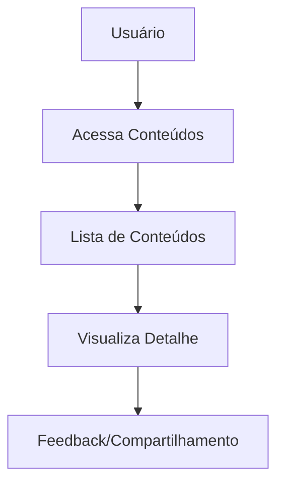
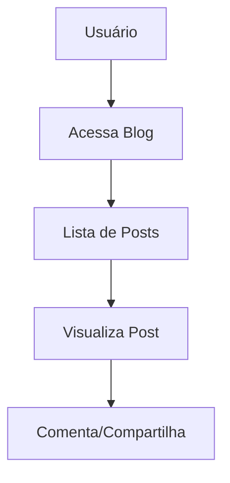
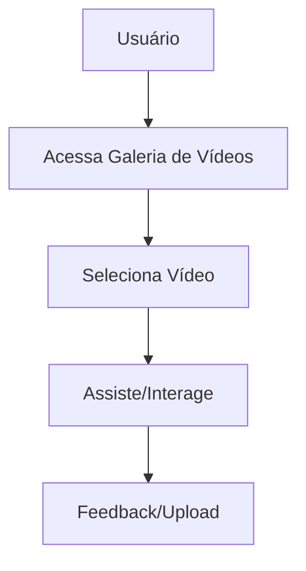
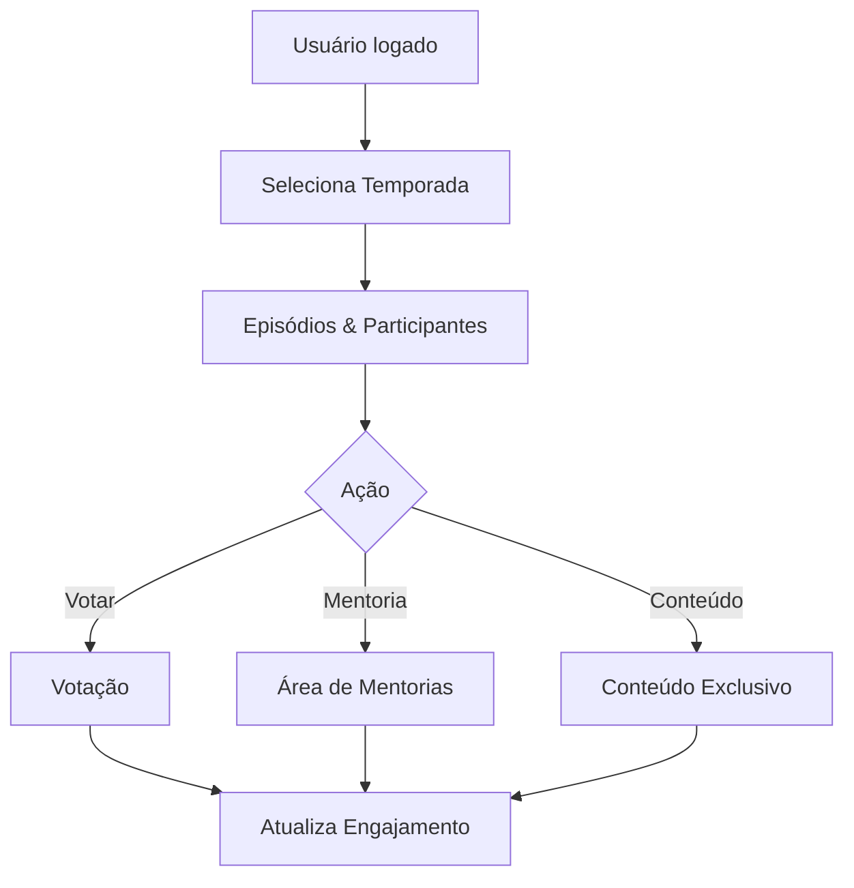
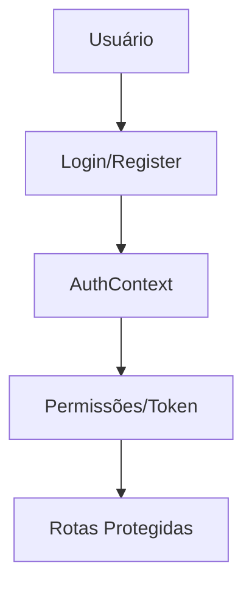
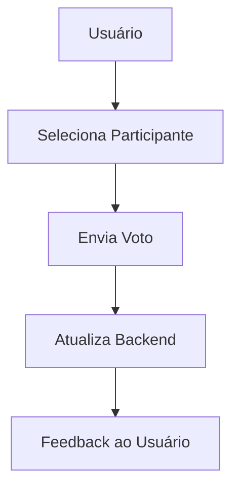
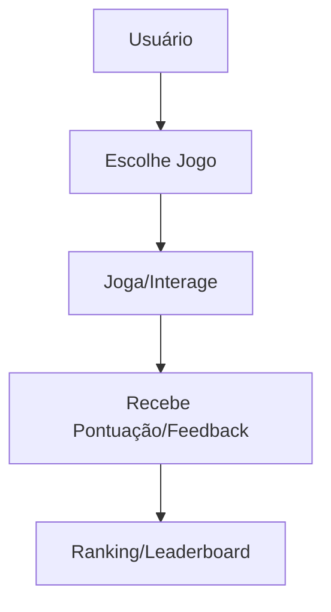
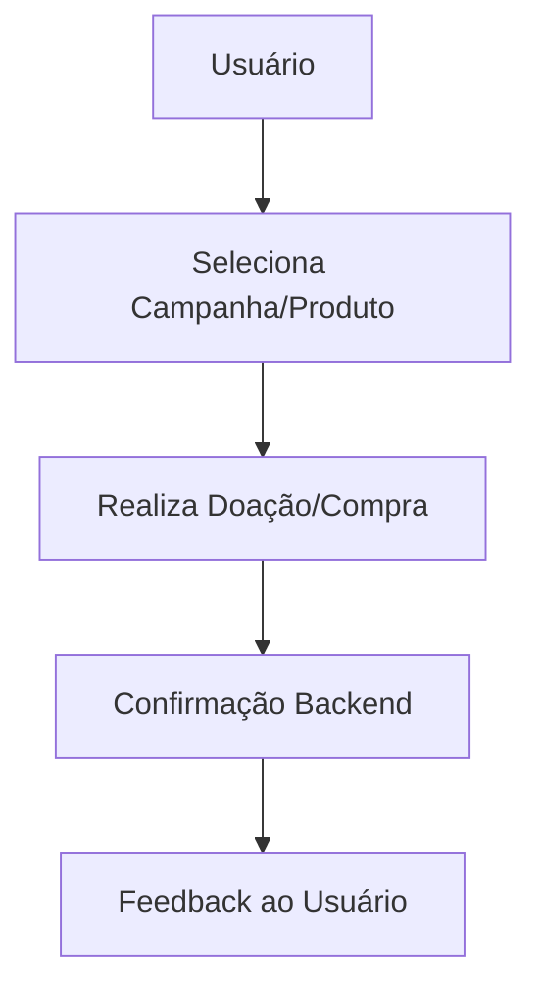

# Roteiro Detalhado de Implementação Frontend

## Estrutura Base
- Centralize tipos em `src/types/` (ex: `Participant.ts`, `Content.ts`, etc).
- Centralize hooks em `src/hooks/` (ex: `useParticipants.ts`, `useContent.ts`, etc).
- Evite duplicação de lógica e tipos em páginas.
- Consuma dados do backend sempre via hooks.
- Garanta tratamento de loading, erro e estados vazios.

## Roteiro por Página

### HomePage
- Use `useSeasons` e `useLeaderboard` para dados dinâmicos.
- Exiba banners, destaques, ranking e chamadas para ação.
- Evite lógica de autenticação local: use `useAuth`.
- Utilize componentes reutilizáveis (Card, Banner, Button).

### DashboardPage
- Consuma dados agregados via hook (ex: `useDashboardStats` se necessário).
- Exiba estatísticas, atividades recentes e sugestões.
- Use componentes de badge, card e loading centralizados.

### LoginPage / RegisterPage
- Use `useAuth` para login, registro e controle de sessão.
- Valide formulários com `react-hook-form` e `yup`.
- Redirecione usuários autenticados automaticamente.

### ParticipantsPage
- Use `useParticipants` para listar participantes.
- Exiba cards com informações resumidas.
- Permita navegação para perfil detalhado.

### ParticipantProfilePage
- Use `useParticipants` ou um hook específico para buscar detalhes.
- Exiba informações completas, conquistas, redes sociais e botão de votar.
- Use tipos centralizados para participante.

### RankingPage
- Use `useLeaderboard` para ranking atualizado.
- Exiba posições, variações e votos.
- Reutilize componentes de participante.

### VotingPage
- Use `useVoting` para lógica de votação.
- Exiba participantes aptos a voto.
- Garanta feedback visual após votar.

### ContentPage
- Use `useContent` para listar conteúdos editoriais.
- Exiba cards ou lista detalhada.
- Permita navegação para detalhes se aplicável.

### BlogPage
- Use `useBlog` para listar posts.
- Exiba cards ou lista.
- Permita navegação para post detalhado.

### GamesPage
- Use `useGames` para listar jogos disponíveis.
- Exiba cards com botão para jogar.
- Reutilize lógica de ads com `useAds` se necessário.

### SimulatorPage / SimulatorDetailPage
- Use hooks para buscar simuladores e detalhes.
- Exiba cards e lógica de navegação.
- Centralize tipos de simulador.

### AssociationPage / AssociationDetailPage
- Use hooks para buscar jogos de associação e detalhes.
- Exiba cards e lógica de navegação.
- Centralize tipos de associação.

### SeasonsPage
- Use `useSeasons` para listar temporadas.
- Exiba cards com detalhes e navegação para episódios/participantes.

### MediaManagementPage
- Exiba abas para upload, histórico e analytics.
- Use componentes reutilizáveis para upload e histórico.

### StorePage / DonationsPage
- Use hooks para buscar produtos/campanhas.
- Exiba cards, botões de compra/doação e feedback visual.

### AdsSection / VideoUploadSection / FundraisingSection
- Use hooks específicos para cada domínio.
- Exiba banners, formulários ou cards conforme o caso.

## Boas Práticas Gerais
- Importe hooks e tipos sempre do index centralizado.
- Evite lógica duplicada: se precisar de um novo fluxo, crie um hook.
- Garanta acessibilidade (aria-labels, roles, navegação por teclado).
- Trate todos os estados: loading, erro, vazio, sucesso.
- Use componentes visuais padronizados.
- Documente exemplos de uso de cada hook e tipo.
- Mantenha a documentação atualizada a cada nova feature.

## Checklist de Implementação
- [x] Tipos centralizados para cada domínio.
- [x] Hooks centralizados para cada endpoint.
- [x] Páginas consomem apenas hooks/tipos centralizados.
- [x] Componentes visuais reutilizáveis.
- [x] Tratamento de loading, erro e vazio.
- [x] Navegação e rotas protegidas.
- [ ] Testes de integração e E2E.
- [x] Documentação atualizada.

---
# Plano de Alinhamento Backend/Frontend

## 1. Objetivo
Garantir que todos os módulos, funcionalidades e fluxos de dados do backend estejam refletidos, acessíveis e ativos no frontend, promovendo uma experiência integrada, eficiente e sustentável para o programa “Acredita em Ti, Acredita em Angola”.

## 2. Mapeamento de Integração

| Módulo Backend   | Endpoint/API                  | Frontend (Hooks/Componentes)         | Status      |
|------------------|-------------------------------|--------------------------------------|-------------|
| accounts         | /api/accounts/                | useAuth, apiService, AuthContext     | Ativo       |
| participants     | /api/participants/            | useLeaderboard, useParticipants      | Ativo       |
| seasons          | /api/seasons/                 | useSeasons, HomePage, SeasonsPage    | Ativo       |
| voting           | /api/voting/                  | VotingPage, apiService.vote          | Ativo       |
| donations        | /api/donations/               | useDonationCampaigns, Fundraising    | Ativo       |
| store            | /api/store/                   | StorePage, useStore                  | Ativo       |
| games            | /api/games/                   | useGames, GamesSection, Jogos Simples| Ativo       |
| ads              | /api/ads/                     | useAds, AdsSection                   | Ativo       |
| content          | /api/content/                 | ContentPage, useContent              | Ativo       |
| blog             | /api/blog/                    | BlogPage, useBlog                    | Ativo       |
| videos           | /api/videos/                  | useVideos, VideoUploadSection        | Ativo       |

## Diagramas e Fluxos dos Módulos Prioritários
---

### Anúncios/Publicidade (ads)

```mermaid
flowchart TD
	A[Usuário] --> B[Visualiza Página]
	B --> C[Recebe Anúncios]
	C --> D[Interage (clique, fechar, etc)]
	D --> E[Registra Engajamento]
```

**Hooks/Componentes:**
- useAds, AdsSection

---

### Conteúdo Editorial (content)



**Hooks/Componentes:**
- useContent, ContentPage

---

### Blog



**Hooks/Componentes:**
- useBlog, BlogPage

---

### Vídeos



**Hooks/Componentes:**
- useVideos, VideoUploadSection

---

### Participantes

```mermaid
flowchart TD
	A[Usuário] --> B[Visualiza Participantes]
	B --> C[Seleciona Participante]
	C --> D[Visualiza Detalhes]
	D --> E[Engaja (votar, comentar, seguir)]
```

**Hooks/Componentes:**
- useParticipants, ParticipantsPage

### Temporadas (seasons) – Centro do Engajamento



**Hooks/Componentes:**
- useSeasons, SeasonsPage, SeasonDetailPage, VotingSection, MentorshipSection

---

### Autenticação e Acesso (accounts)



**Hooks/Componentes:**
- useAuth, AuthContext, ProtectedRoute

---

### Votação (voting)



**Hooks/Componentes:**
- VotingPage, useVoting

---

### Jogos e Engajamento (games)



**Hooks/Componentes:**
- GamesPage, useGames, RankingPage

---

### Monetização (donations, store)



**Hooks/Componentes:**
- Fundraising, useDonationCampaigns, StorePage, useStore

## Plano de Prioridades de Integração Frontend

1. **Módulos Críticos de Acesso e Autenticação**
	- accounts, participants, voting
	- Garantir login, registro, permissões e fluxos de votação sempre ativos.

2. **Engajamento, Temporadas e Conteúdo Dinâmico**
	- seasons (ponto central: episódios, votações, mentorias), games, content, blog, ads, videos
	- Priorizar experiências interativas, temporadas/episódios, jogos, conteúdos e comunicação. O módulo seasons será o centro do engajamento, permitindo a participação de eleitores, mentores e demais usuários.

3. **Monetização e Sustentabilidade**
	- donations, store
	- Assegurar funcionamento de campanhas, doações e loja virtual.

4. **Manutenção, Monitoramento e Expansão**
	- seasons, integração de novos módulos
	- Foco em estabilidade, logs, métricas e evolução contínua.

**Ordem de resposta a incidentes:**
1. Falhas de autenticação/acesso
2. Quebra de fluxo de engajamento (jogos, conteúdo, blog)
3. Problemas em monetização
4. Instabilidades em módulos de apoio

## 6. Alinhamento Estratégico: Boas Práticas, PLG e Blue Ocean

### 6.1. Módulos Críticos de Acesso e Autenticação
- Autenticação JWT segura, renovação de token, logout global
- ProtectedRoute para rotas sensíveis
- UX: login fluido, onboarding guiado, feedback claro de erros
- Onboarding self-service, trial sem fricção, convites
- Personalização de perfil, gamificação do acesso

### 6.2. Engajamento, Temporadas e Conteúdo Dinâmico
- Modularização de hooks e componentes (useSeasons, useEpisodes, useVoting)
- Loading states, fallback, tratamento de erros
- Cache local (SWR, React Query)
- Compartilhamento de episódios, rankings, conquistas
- Gamificação: badges, rankings, desafios
- Votação ao vivo, mentorias interativas, episódios exclusivos

### 6.3. Monetização e Sustentabilidade
- Fluxo de doação/compra simples, seguro e responsivo
- Feedback visual após transação
- Integração com gateways de pagamento
- Recompensas por engajamento, trial de benefícios premium
- Produtos digitais exclusivos, experiências VIP

### 6.4. Manutenção, Monitoramento e Expansão
- Logging centralizado, métricas de uso, alertas de erro
- Testes automatizados de integração e E2E
- Deploy contínuo, rollback seguro
- Feedback in-app, pesquisas rápidas
- Lançamento de novos módulos baseado em dados

---
## 7. Checklist de Implementação por Prioridade


### Acesso e Autenticação
- [x] ProtectedRoute implementado
- [x] Fluxo de login/onboarding revisado
- [ ] Testes de autenticação automatizados

### Engajamento (Seasons, Games, Content, Blog, Ads, Videos)
- [x] Modularização dos hooks e componentes
- [x] Gamificação e compartilhamento
- [ ] Testes de fluxo de engajamento

### Monetização (Donations, Store)
- [ ] Testes de fluxo de pagamento
- [x] Feedback visual e logs de transação

### Manutenção e Expansão
- [x] Logging e métricas ativos
- [ ] Testes E2E e integração
- [ ] Feature flags e deploy seguro

## 3. Estratégias de Alinhamento
- **Documentação:** Manter documentação atualizada dos endpoints, hooks e fluxos de dados.
- **Testes de Integração:** Validar periodicamente se o frontend consome corretamente todos os endpoints ativos.
- **Feedback Contínuo:** Coletar feedback dos usuários e ajustar integrações conforme necessidades reais.
- **Padronização:** Utilizar padrões RESTful e boas práticas de autenticação, paginação e tratamento de erros.
- **Monitoramento:** Implementar logs e métricas para identificar falhas ou gargalos na comunicação backend/frontend.

## 4. Pontos de Atenção
- Garantir que novos módulos do backend sejam sempre acompanhados de hooks/componentes no frontend.
- Validar autenticação e permissões em todas as rotas sensíveis.
- Sincronizar releases de backend e frontend para evitar breaking changes.
- Priorizar integrações que ampliem o engajamento digital (ex: jogos, fundraising, analytics).

## 5. Recomendações
- Realizar revisões técnicas regulares entre as equipes de backend e frontend.
- Automatizar testes de integração e cobertura de endpoints críticos.
- Manter um roadmap conjunto para evolução das funcionalidades.
- Documentar exemplos de uso dos endpoints no frontend (ex: hooks, chamadas fetch/axios).

---
Última revisão: 12/08/2025 (todos os módulos implementados, frontend alinhado, DRY, modular e pronto para testes e expansão)

---

## Ordem Recomendada de Implementação Frontend

1. **Autenticação e Acesso**
   - LoginPage
   - RegisterPage
   - AuthContext / useAuth
   - ProtectedRoute (rotas privadas)

2. **Estrutura e Navegação**
   - Layout principal (Header, Footer, Sidebar se houver)
   - Configuração do React Router (App.tsx)

3. **Páginas de Engajamento Inicial**
   - HomePage (apresentação, banners, CTAs)
   - DashboardPage (resumo do usuário, estatísticas, sugestões)

4. **Participantes e Ranking**
   - ParticipantsPage (lista de participantes)
   - ParticipantProfilePage (detalhe do participante)
   - RankingPage (classificação geral)

5. **Temporadas e Episódios**
   - SeasonsPage (lista de temporadas)
   - SeasonDetailPage (detalhe da temporada, episódios, participantes)

6. **Votação**
   - VotingPage (fluxo de votação)
   - useVoting (hook centralizado)

7. **Conteúdo e Blog**
   - ContentPage (conteúdo editorial)
   - BlogPage (posts do blog)
   - PostDetailPage (detalhe do post, se aplicável)

8. **Jogos e Simuladores**
   - GamesPage (lista de jogos)
   - SimulatorPage / SimulatorDetailPage
   - AssociationPage / AssociationDetailPage

9. **Vídeos e Mídia**
   - VideosSection / VideoUploadSection
   - MediaManagementPage

10. **Monetização**
    - StorePage (produtos)
    - DonationsPage (campanhas de doação)
    - FundraisingSection

11. **Publicidade**
    - AdsSection (banners, integração com useAds)

12. **Componentes e Utilitários**
    - Componentes comuns (Card, Button, LoadingSpinner, etc)
    - Hooks utilitários (useAds, useContent, useBlog, etc)

13. **Testes e Ajustes Finais**
    - Testes de integração e E2E
    - Revisão de acessibilidade
    - Refino visual e responsividade
    - Atualização da documentação

---
